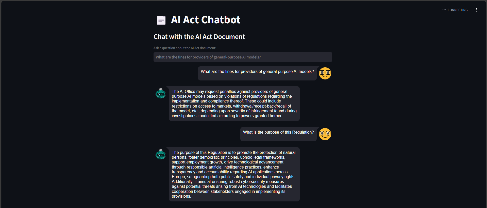

# Building a RAG Chatbot for Technical Documentation

This project demonstrates how to build a Retrieval-Augmented Generation (RAG) chatbot to answer questions about technical documentation. The chosen document for this demonstration is the [Artificial Intelligence Act](https://www.europarl.europa.eu/doceo/document/TA-9-2024-0138_EN.pdf), recently passed by the European Parliament.

## Project Overview

Our approach follows the steps below:
1. Split the document into chunks of text
2. Generate and store the embeddings for each chunk
3. Create a retriever model to find the most relevant chunks for a given question
4. Initialize the LLM and prompt template
5. Define RAG chain
5. Invoke RAG chain

## Pre-requisites

To reproduce this project, ensure you have Python installed on your system. Then, install the required libraries:

```bash
pip install transformers
pip install torch
pip install faiss-cpu
pip install langchain
pip install langchain_huggingface
pip install streamlit
pip install streamlit_chat
```

## Usage Instructions

### 1. Clone the Repository

```bash
git clone https://github.com/eduardooliveiraps/RAG-Chatbot-Technical-Docs.git 
```

### 2. Navigate to the Project Directory

```bash
cd ai_act_chatbot
```

### 3. Download the Models

To ensure models are available locally, run the download_models.py script:

```bash
python download_models.py
```

### 4. Preprocess the Document

To preprocess the AI Act document, splitting it into chunks, generating embeddings, and storing them, run the preprocess_ai_act.py script:

```bash
python preprocess_ai_act.py
```

### 5. Start the Chatbot Interface

Next, launch the chatbot interface using Streamlit:

```bash
streamlit run streamlit_interface.py
```

Alternative Command: If the above command encounters issues, try running:

```bash
python -m streamlit run streamlit_interface.py
```

I found [this GitHub issue](https://github.com/charann29/opensource/issues/356) useful for solving the Streamlit run problem.

### 5. Interact with the Chatbot

Once the Streamlit server is running, open the provided URL in your browser to interact with the chatbot. Ask questions about the AI Act, and the chatbot will provide relevant answers. Each response may take approximately 60 seconds to generate, depending on your machine's processing capabilities.



## Conclusion

This project demonstrates how to build a RAG chatbot for technical documentation. The chatbot can answer questions about the AI Act, providing relevant information from the document. You can extend this project by using different documents, customizing the prompt template, or fine-tuning the models for better performance.

